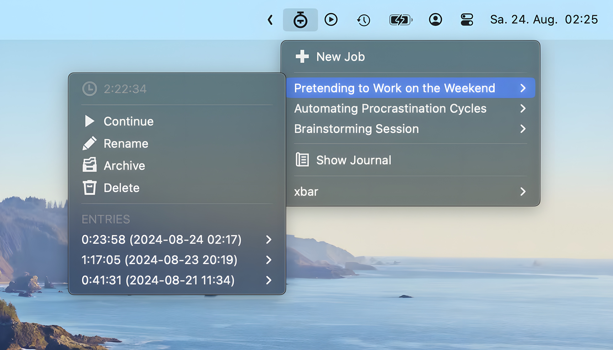

# TimeOnTrack

**TimeOnTrack** is a sophisticated time tracker for [xbar](https://xbarapp.com) that allows you to track, pause, and manage multiple projects simultaneously. It provides a convenient way to log time spent on different tasks and review your work history.

- Track multiple projects concurrently
- Start, pause, and stop timers for each project
- Rename, archive, and delete projects and time entries
- View and edit logged time entries
- Generate and view a detailed journal of your tracked time
- Supports localization

## Features

### Track Jobs Individually

Create named jobs that represent different tasks, projects, or activities. Each job operates independently, allowing you to start and stop timers as needed. This enables you to manage multiple client projects or break down your workflow into specific tasks, providing the flexibility to track time as required.

### Seamless Switching Between Jobs

Easily switch between tasks without losing track of time. Pause tracking on one job and start tracking another immediately. You can return to the paused job later and continue tracking from where you left off. This is particularly useful for multitaskers who need to switch contexts frequently.

### Detailed Entry Management

Each job consists of multiple time entries, representing individual tracking sessions. These entries can be edited or deleted as needed. If time was booked on the wrong job or the timer was not paused during a break, the duration of the entry can be adjusted to correct the record. This ensures that your time tracking remains accurate.

### Archiving Jobs to Declutter Your Workspace

Completed or inactive jobs can be archived, keeping the data intact for future reference while decluttering your active job list. Archived jobs are hidden from the main view but remain accessible through the journal, ensuring that all data is preserved.

### Comprehensive Journal Overview

The journal provides an overview of all jobs, both active and archived. It displays detailed information about each job, including total time tracked, individual entries, and timeframes. This makes it easy to review work history, generate reports, or reflect on how time was spent.

> 🛠️ **Work-in-progress:** This feature is still in development

## Localization

By default, the script uses the language of macOS if available, and falls back to en_US if no translation is available. You can override this behavior by defining a language key in the plugin settings.

Language files are stored in the `TimeOnTrack/lang/` directory. You can create your own translation by copying an existing one and translating the strings. Use the correct language key for your language and region (according to RFC 5646). If you do so, please share it with the community so others can benefit from it.

## Acknowledgments

I used [worktime-tracker](https://xbarapp.com/docs/plugins/Time/worktime-tracker.1s.rb.html) by [@hSATAC](https://xbarapp.com/docs/contributors/hSATAC.html) or quite some time, and I drew some inspiration from it. However, the limitation to a single project was not suitable for me in the long run, so I wrote a more sophisticated plugin for my daily use.

## License

This project is licensed under the MIT License.

## Contributing

Contributions are welcome! Feel free to submit a pull request or open an issue for any improvements or bug fixes.
